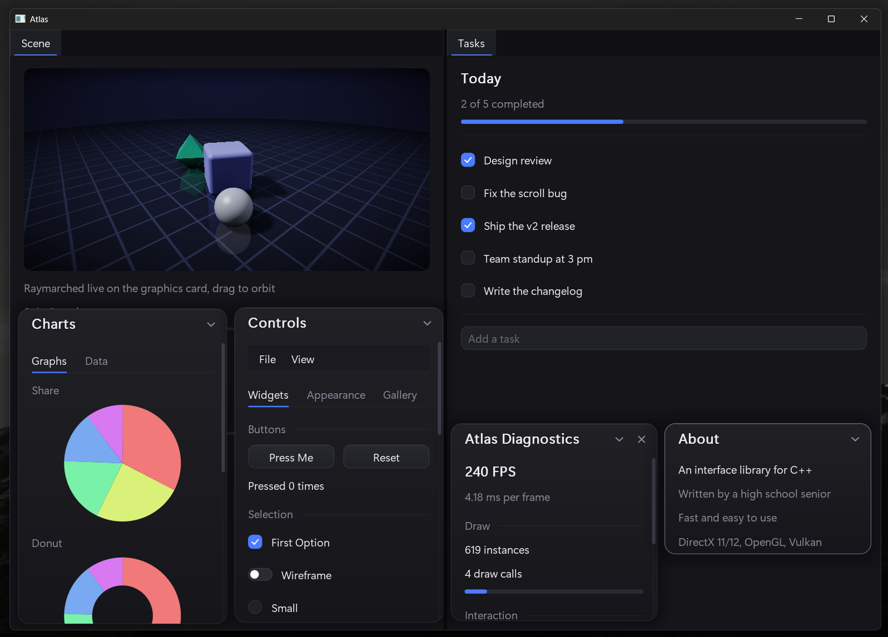
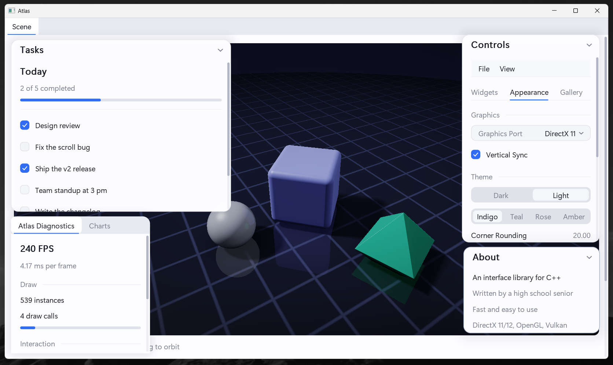
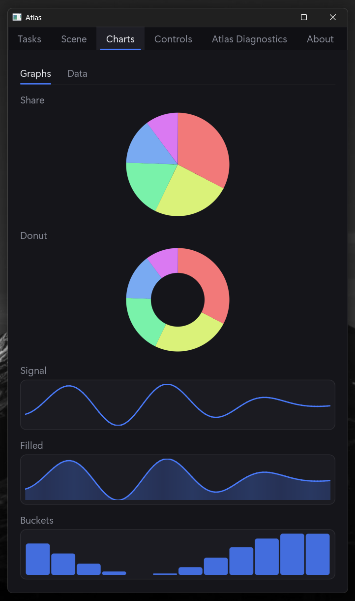
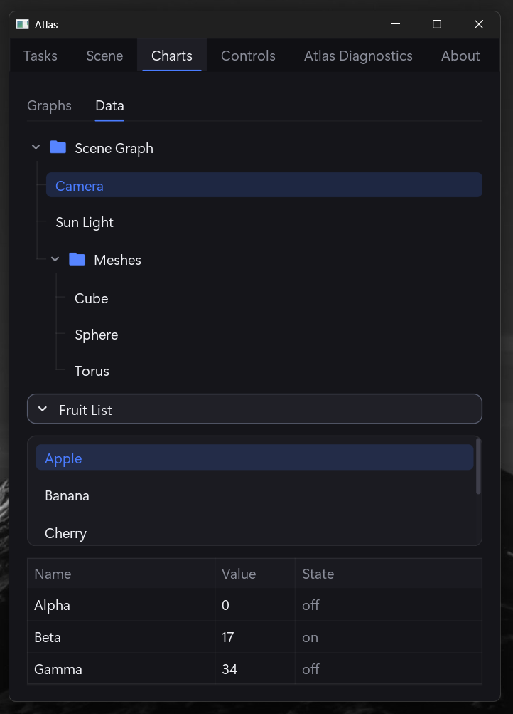

# Atlas

A fast, modern **GUI library for C++**, built for Windows with backends for **DirectX 11, DirectX 12, OpenGL, and Vulkan**.

Atlas draws an entire UI with windows, docking, tabs, menus, tables, charts, a color picker, text editing. One universal shader system runs the same effects across every backend to keep you from wasting time, and a `Custom` callback lets you drop native 3D rendering straight into the UI.

> A summer project written during my free time from scratch, with MSVC, and no third party dependencies



## Features

- **Every common widget** - Buttons, checks, toggles, radios, sliders, drags, spinners, single- and multi-line text (selection, clipboard, undo), combo, segmented control, trees, collapsibles, lists, tables with resizable columns, tabs, menus, popups, tooltips, plots/histograms/pie charts, HSV color picker.
- **Docking** - Anchor pills, floating windows, tabbed islands, splitters and layout saving.
- **Four backends, one API** - Support for DirectX 11/12, OpenGL 4.3, and Vulkan.
- **Universal shaders** - Write one effect body, run it on HLSL and GLSL automatically.
- **Native 3D support** - Render meshes or scenes inside any panel via `Canvas->Custom`.
- **Customizable** - Dark/light presets with style control, and smooth built in animations.
- **Self-contained** - No third-party libraries.

## Screenshots

|                    Light theme & live theming                     |                              Docked & compact                              |
| :---------------------------------------------------------------: | :------------------------------------------------------------------------: |
|         |  |
|                        **Charts & plots**                         |                         **Trees, lists & tables**                          |
|  |            |

## Requirements

- Windows 10/11
- Visual Studio 2026 (v145 toolset), C++17 (Can be downgraded)
- DirectX 11/12 and OpenGL work out of the box. Vulkan is gated behind the `ATLAS_VULKAN` define and needs the Vulkan SDK. (https://vulkan.lunarg.com/sdk/home)

## Build

```
git clone https://github.com/0Zayn/Atlas.git
cd Atlas
```

Open `Atlas.slnx` in Visual Studio and build, or from a Developer prompt:

```
msbuild Sample/Sample.vcxproj -p:Configuration=Release -p:Platform=x64
```

Run the demo from `Build/Release/Sample.exe`. Everything generated lives at the repo root: `Build/`, `Intermediates/`, and the redistributable SDK in `Package/`.

## Quick start

The host owns the window, device, swapchain, and present loop; Atlas builds and renders the UI. Each frame:

```cpp
#include "Atlas.h"

Atlas->Create( ); /* Done once, after your device exists */

/* Done every frame */
Atlas->Begin( CVector( Width, Height ) );

if ( Frames->Begin( "Hello" ) ) {
    Widgets->Label( "Welcome to Atlas" );

    if ( Widgets->Button( "Click me" ) )
        Count++;

    Widgets->Slider( "Volume", Volume, 0.0f, 100.0f );
}
Frames->End( );

Atlas->End( );
Host->Graphics( )->Render( Atlas->Data( ), Host->Stream( ) ); /* Your backend */
```

`Sample/` is a complete reference app with host wrappers you can copy for all four backends. See [DOCS.md](DOCS.md) for the full API.

## Using the prebuilt SDK

`Package/` is a drop-in SDK produced on every build:

- `Package/Include/` - All public headers, mirroring the source tree.
- `Package/Library/Atlas.lib` - The static library.

Add `Package/Include` (and folders directly in it) to your include paths and link `Package/Library/Atlas.lib`.

## Support

Atlas is free and open source. If it's useful to you and you'd like to support its development, you can donate here:

- ☕ [Buy Me a Coffee](https://buymeacoffee.com/0zayn)
- 💜 [GitHub Sponsors](https://github.com/sponsors/0Zayn)

## License

MIT - see [LICENSE](LICENSE).